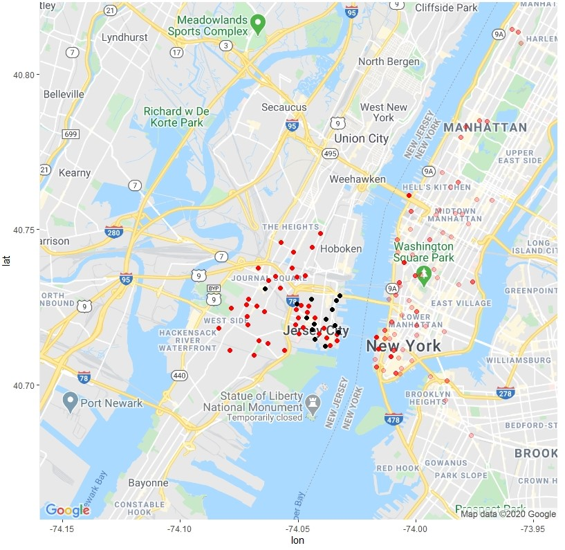
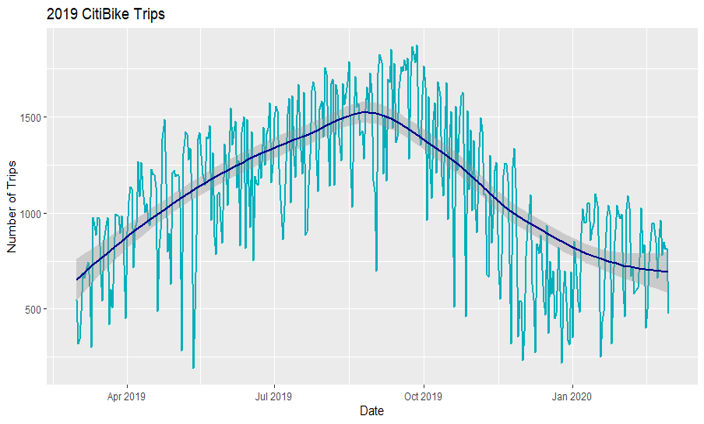
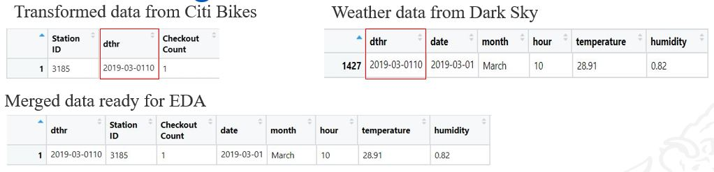
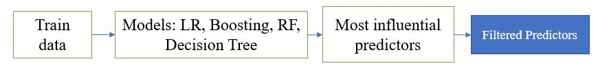
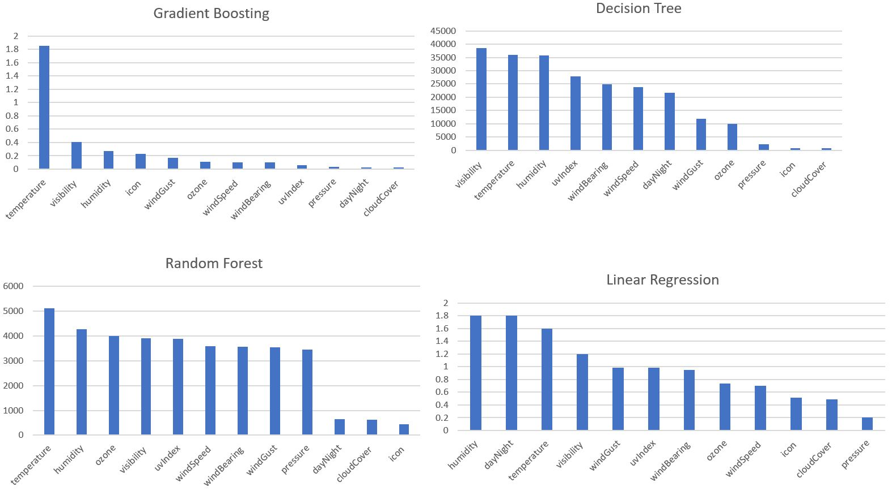
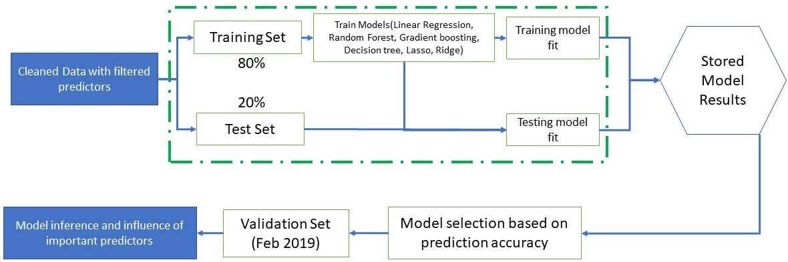
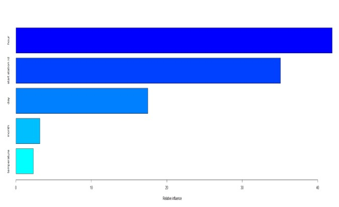

# Hourly CitiBike Prediction in Jersey City

Authors:  **Aravindh Siddharth Prabaharan**, **Arvind Ram Karthikeyan**

---

## Intro
To predict the checkout count of Citi Bikes at a given hour in Jersey City, thereby, determining the influence of weather on stations with high checkout frequency


---

## Sources
- The data source is from [CitiBike](https://www.citibikenyc.com/system-data)
- The code retrieves weather data from [Darksky API](https://darksky.net/dev)
- The link to use [Gmap](https://cloud.google.com/maps-platform/)
---

## Explanation of the Code

The code, `citibike.R`, begins by importing necessary R libraries:
```
library(dplyr)
library(tidyverse)
library(broom)
library(ggmap)
library(moments)
library(gbm)
library(rpart)
library(randomforest)
library(glmnet)
```
- *NOTE 1: The CitiBike data pulled can also be pulled using API in json format.*  
- *NOTE 2: The data may change over time and the results may not be same everytime.*

Day, month and Year are extracted
```
#extracting date,month,year,time
fulln_model$month = months(as.Date(fulln_model$date))
fulln_model$day = weekdays(as.Date(fulln_model$date))
tm1.lt <- as.POSIXlt(fulln$starttime)
fulln_model$hour=tm1.lt$hour
```


### Data Visualization:
```
#------------------------Visualizing using Gmaps-------------------------------

library(ggmap)
ggmap::register_google(key = "YOUR KEY")

p <- ggmap(get_googlemap(maptype="terrain",zoom=11,center = c(lon = 74.0431, lat = 40.7178)))
p + geom_point(aes(x =Start_Lng , y =Start_Lat ),colour = 'red', incidents, alpha=0.25, size = 0.5) + 
  theme(legend.position="bottom")
p + geom_point(aes(x =Start_Lng , y =Start_Lat ),colour = 'red', i2rain, alpha=0.25, size = 0.5) + 
  theme(legend.position="bottom")
  
Finally, we visualize the data.  We save our plot as a `.jpeg` image:
```
The output from this code is shown below:

Distribution of trips at different hour


```
#---------------------Weather Data merge-------------------------------------------------
darksky=read.csv('G:/project/dark_sky.csv', header=TRUE)
fulln_model=fulln[,c("starttime","stoptime","start.station.id","end.station.id","date")]

#extracting date,month,year,time
fulln_model$month = months(as.Date(fulln_model$date))
fulln_model$day = weekdays(as.Date(fulln_model$date))
tm1.lt <- as.POSIXlt(fulln$starttime)
fulln_model$hour=tm1.lt$hour

#extracting date,month,year,time for weather
darksky$date = as.Date(darksky$time, format = "%Y-%m-%d")
tm2.lt <- as.POSIXlt(darksky$time)
darksky$hour=tm2.lt$hour

#remove unwanted columns weather
darksky=subset(darksky, select=-c(summary,icon,precipIntensity,precipProbability,precipType,precipAccumulation,                                ozone,uvIndex,windGust,windBearing,cloudCover,apparentTemperature))
darksky=darksky[!duplicated(darksky$time), ]

#Merging weather with model
darksky$dthr=paste(darksky$date,darksky$hour, sep="")
fulln_model$dthr=paste(fulln_model$date,fulln_model$hour, sep="")
fi=merge(fulln_model,darksky,by.x = "dthr",by.y = "dthr")
```
The merge of weather with CitiBike data is shown:



#### Process for Filtering of predictors and Model framework used for modeling


Predictor Influence on each model:





#### Best Model Result

```
#------------------------Gradient Boosting results-------------------------------

library(gbm)
gbmboosting <- gbm(checkout_count_hr~.,data =  train, n.trees=500, interaction.depth = 3,shrinkage = 0.05)
gbmpred <- round(predict(gbmboosting, newdata = train, n.trees = 500))

#mean(gbmpred==train$checkout_count_hr)
summary(gbmboosting)
eval_results(train$checkout_count_hr,gbmpred,train)
```

The output from this code is shown below:


---

## How to Run the Code using R Studio
*1. Click on File->Open*

*2. Choose directory where `citibike.R` is stored*

*3. Click on run or Ctrl+Enter*

*4. The Results are displayed in Global Environment(right) and the plots are shown (bottom right) in R studio*

---

## Suggestions
Spatial relation with neighboring stations can be considered.The predicted checkout frequency can be converted to a classification namely high, mid and low therevy incresing the prediction accuracy. Pricing of Citi Bikes can be taken into consideration for comparison. Special occasions or global situations may fluctuate the demand. Moreover, Efficient urban planning and better transportation infrastructure can balance supply demand.
